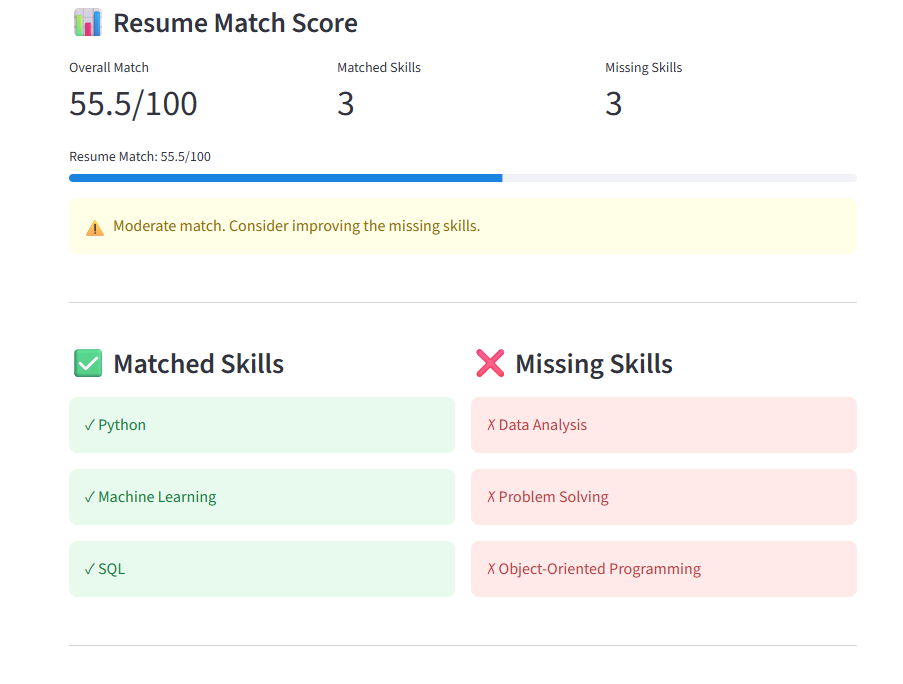

# 🤖 AI Resume Analyzer

An AI-powered resume analysis system that evaluates a candidate's resume against a job description using LLMs, semantic search, FAISS, and weighted skill matching.

## 🚀 Features

- 📄 PDF resume processing
- 🧠 Sentence Transformer embeddings
- 🔎 FAISS-based semantic retrieval
- 🤖 LLM-powered job description analysis
- 🎯 Required and preferred skill extraction
- ⚖️ Weighted skill matching and scoring
- 📊 Evidence-based skill evaluation
- 💡 AI-generated improvement suggestions
- 🗂️ Job description caching
- ⚡ Performance tracking
- 🔐 Environment-based API key configuration
- 🌐 FastAPI REST API
- 🎨 Streamlit frontend
- 🐳 Docker and Docker Compose support
- 🧪 Automated tests
- 📝 Application logging

🧰 Tech Stack
Backend
-Python
-FastAPI
-Uvicorn
-Pydantic
-AI / ML
-Sentence Transformers
-FAISS
-Groq LLM API
-LangChain
-PyPDF

Frontend
Streamlit

DevOps
Docker
Docker Compose
Git
GitHub

Testing
Pytest

## 📸 Application Screenshot

